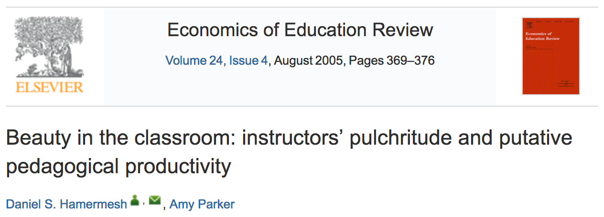

```{r}
#| label: setup
#| message: false

library(tidyverse)
library(ggplot2)
library(patchwork)
theme_set(theme_minimal())

options(scipen = 9999, digits=8)

# Load and clean data
houses <- read_csv("class_02_docs/houses.csv")
```

# Posit Cloud vs RStudio

- Originally we had planned for you to use Posit Cloud not just for quizzes/exams, but for in-class work and homework too
- It turns out that the limits on the free version of Posit Cloud are too restrictive
- New plan:
  - You can use Posit Cloud for quizzes/exams
  - You can use RStudio (install on your computer) for in-class work and homework

# Measuring prediction error

## Predicting price from area

```{r, echo=FALSE}
# Plot 1: Scatterplot of price vs area with fitted regression line

ggplot(houses, aes(x = area, y = price)) +
  geom_point(alpha = 0.4, color = "gray30") +
  geom_smooth(method = "lm", se = FALSE, color = "#0072B2", linewidth = 1.2) +  # Colorblind-safe blue
  scale_y_continuous(labels = scales::comma_format()) +
  scale_x_continuous(labels = scales::comma_format()) +
  labs(
    x = "Living Area (sq ft)",
    y = "Sale Price ($)",
    title = "Home Sale Price vs Living Area"
  ) +
  theme_minimal() +
  theme(
    plot.title = element_text(hjust = 0.5, size = 14, face = "bold"),
    axis.title = element_text(size = 12),
    axis.text = element_text(size = 10)
  )
```

## Residuals and fitted values
- The **fitted value** ("y hat") for observation $i$ is the predicted value from the regression line:
$$
\widehat{y}_i = \widehat{\beta_0} + \widehat{\beta_1} \times \text{area}_i
$$
- The **residual** is the corresponding prediction error: 
$$e_i = y_i - \widehat{y}_i = \text{observed price} - \text{predicted price}$$

- The fitted line tells us about the part of price **predictable** from area
- The residuals tell us about the part of price **not predictable** from area

## Visualizing residuals and fitted values

```{r, fig.width=7, fig.height=5}
# Plot 2: Static scatterplot showing selected residuals

# Set text size for annotations
label_size <- 3.5

# Fit the model
fit <- lm(price ~ area, data = houses)
b0 <- coef(fit)[1]
b1 <- coef(fit)[2]

# Add fitted values and residuals to data
houses_with_resid <- houses %>%
  mutate(
    fitted = predict(fit),
    residual = price - fitted
  )

# Select 6-8 examples spread across area range with mix of positive/negative residuals
# Sort by residual size and pick good examples
houses_sorted <- houses_with_resid %>%
  arrange(residual)

# Pick 2 examples: positive residual ~1500 sqft, negative residual ~2800 sqft
# But where the larger house still has higher price than smaller house
set.seed(456)
example_pos <- houses_with_resid %>% 
  filter(residual > 0, area >= 1400, area <= 1600) %>% 
  slice_max(residual, n = 1)

example_neg <- houses_with_resid %>% 
  filter(residual < 0, area >= 2700, area <= 2900, price > example_pos$price) %>% 
  slice_min(residual, n = 1)

examples <- bind_rows(example_pos, example_neg)

# Create the plot
ggplot(houses, aes(x = area, y = price)) +
  geom_point(alpha = 0.2, color = "gray60", size = 1.5) +
  geom_smooth(method = "lm", se = FALSE, color = "#0072B2", linewidth = 1) +
  # Add segments for selected points
  geom_segment(data = examples,
               aes(x = area, xend = area, y = price, yend = fitted,
                   color = ifelse(residual > 0, "Positive", "Negative")),
               linewidth = 0.8) +
  # Highlight the selected points
  geom_point(data = examples, aes(color = ifelse(residual > 0, "Positive", "Negative")),
             size = 3) +
  # Add points on the line for fitted values
  geom_point(data = examples, aes(x = area, y = fitted),
             color = "#0072B2", size = 3) +
  # Add residual labels with explicit formula
  geom_label(data = examples,
             aes(x = area + 80, 
                 y = (price + fitted) / 2,
                 label = paste0("e = y - ŷ = $", scales::comma(round(residual, 0))),
                 color = ifelse(residual > 0, "Positive", "Negative")),
             hjust = 0, size = label_size, fontface = "bold", 
             fill = "white", label.padding = unit(0.25, "lines")) +
  # Label actual values (observed points)
  geom_label(data = examples,
             aes(x = area - 80, y = price,
                 label = paste0("y = $", scales::comma(round(price, 0)))),
             hjust = 1, size = label_size - 0.5, color = "black",
             fill = "white", label.padding = unit(0.25, "lines")) +
  # Label fitted values
  geom_label(data = examples,
             aes(x = area - 80, y = fitted,
                 label = paste0("ŷ = $", scales::comma(round(fitted, 0)))),
             hjust = 1, size = label_size - 0.5, color = "black",
             fill = "white", label.padding = unit(0.25, "lines")) +
  scale_color_manual(values = c("Positive" = "#009E73", "Negative" = "#D55E00"),
                     name = "Residual") +
  scale_y_continuous(labels = scales::comma_format()) +
  scale_x_continuous(labels = scales::comma_format()) +
  labs(
    x = "Living Area (sq ft)",
    y = "Sale Price ($)",
    title = "Residuals: Deviations from the Fitted Line"
  ) +
  theme_minimal() +
  theme(
    plot.title = element_text(hjust = 0.5, size = 14, face = "bold"),
    axis.title = element_text(size = 12),
    axis.text = element_text(size = 10),
    legend.position = "none"
  )
```

## What does a residual tell us?


```{r, fig.width=7, fig.height=5}
# Plot 9: Comparing two specific houses using residuals

# Define the two specific houses from our analysis
house_a <- data.frame(
  streetAddress = "4710 Rue St",
  area = 1703,
  price = 835000,
  zipcode = "78731",
  label = "House A"
)

house_b <- data.frame(
  streetAddress = "3905 Petra Path",
  area = 3670,
  price = 749000,
  zipcode = "78731",
  label = "House B"
)

# Add fitted values and residuals for these specific houses
house_a$fitted <- b0 + b1 * house_a$area
house_a$residual <- house_a$price - house_a$fitted

house_b$fitted <- b0 + b1 * house_b$area
house_b$residual <- house_b$price - house_b$fitted

comparison_houses <- rbind(house_a, house_b)

ggplot(houses, aes(x = area, y = price)) +
  geom_point(alpha = 0.15, color = "gray70", size = 1.5) +
  geom_smooth(method = "lm", se = FALSE, color = "#0072B2", linewidth = 1) +
  # Segments showing residuals
  geom_segment(data = comparison_houses,
               aes(x = area, xend = area, y = price, yend = fitted,
                   color = label),
               linewidth = 1.2) +
  # Observed points
  geom_point(data = comparison_houses,
             aes(color = label),
             size = 4) +
  # Fitted points on the line
  geom_point(data = comparison_houses,
             aes(x = area, y = fitted, color = label),
             size = 3, shape = 1, stroke = 1.5) +
  # Labels for House A
  annotate("label", x = house_a$area - 100, y = house_a$price + 50000,
           label = paste0("House A\n", house_a$area, " sq ft\n$", 
                         scales::comma(house_a$price), "\nResidual: +$",
                         scales::comma(round(house_a$residual, 0))),
           hjust = 1, color = "#009E73", fontface = "bold",
           fill = "white", size = 3.5) +
  annotate("text", x = house_a$area + 300, y = (house_a$price + house_a$fitted)/2+100000,
           label = "Sold for MORE\nthan expected",
           hjust = 0, color = "#009E73", fontface = "italic", size = 3) +
  # Labels for House B
  annotate("label", x = house_b$area - 500, y = house_b$price - 200000,
           label = paste0("House B\n", house_b$area, " sq ft\n$", 
                         scales::comma(house_b$price), "\nResidual: $",
                         scales::comma(round(house_b$residual, 0))),
           hjust = 0, color = "#D55E00", fontface = "bold",
           fill = "white", size = 3.5) +
  annotate("text", x = house_b$area - 300, y = (house_b$price + house_b$fitted)/2-120000,
           label = "Sold for LESS\nthan expected",
           hjust = 1, color = "#D55E00", fontface = "italic", size = 3) +
  scale_color_manual(values = c("House A" = "#009E73", "House B" = "#D55E00"),
                     name = NULL) +
  scale_y_continuous(labels = scales::comma_format()) +
  scale_x_continuous(labels = scales::comma_format()) +
  labs(
    x = "Living Area (sq ft)",
    y = "Sale Price ($)",
    title = ""
  ) +
  theme_minimal() +
  theme(
    plot.title = element_text(hjust = 0.5, size = 14, face = "bold"),
    axis.title = element_text(size = 12),
    axis.text = element_text(size = 10),
    legend.position = "none"
  )
```

## What is a "typical" residual?

- The residual tells us the prediction error for a given point
- The **standard deviation of the residuals** tells us the typical **size** of these prediction errors (in absolute value)
- It's a measure of how **variable our prediction errors are**
    - Low variability: our predictions are usually close to actual values
    - High variability: our predictions are often far off from actual values
- In R, this is called the **Residual Standard Error (RSE)**

##

```{r, echo=TRUE}
#| class-output: "highlight numberLines"
#| output-line-numbers: "16"
summary(fit)
```

From line 16: RSE = $155,630

## 

```{r}
houses_both <- houses %>%
  mutate(
    null_resid = price - mean(price),
    fitted = predict(fit),
    resid = price - fitted
  )


# Select the same examples for both models
set.seed(12443)
examples_both <- houses_both %>%
  mutate(price_bin = cut(resid, breaks = 5)) %>%
  group_by(price_bin) %>%
  slice_sample(n = 1) %>%
  ungroup() %>%
  slice_head(n = 5)

# Assign colors to examples
example_colors <- c("#E69F00", "#56B4E9", "#009E73", "#F0E442", "#CC79A7")
examples_both <- examples_both %>%
  mutate(color = example_colors[1:n()])

# Calculate shared x-axis limits for histograms
hist_xlim <- range(c(houses_both$null_resid, houses_both$resid))


# Panel C: Regression model scatterplot
panel_c <- ggplot(houses_both, aes(x = area, y = price)) +
  geom_point(alpha = 0.15, color = "gray70", size = 1.5) +
  geom_smooth(method = "lm", se = FALSE, color = "#0072B2", linewidth = 1.2) +
  geom_segment(data = examples_both,
               aes(x = area, xend = area, y = price, yend = fitted, color = color),
               linewidth = 1, show.legend = FALSE) +
  geom_point(data = examples_both, aes(color = color), size = 3, show.legend = FALSE) +
  geom_point(data = examples_both, aes(x = area, y = fitted),
             color = "#0072B2", size = 2.5) +
  scale_color_identity() +
  scale_y_continuous(labels = scales::comma_format()) +
  scale_x_continuous(labels = scales::comma_format()) +
  labs(
    x = "Living Area (sq ft)",
    y = "Sale Price ($)",
    title = "Regression fit + example residuals"
  ) +
  theme_minimal() +
  theme(
    plot.title = element_text(size = 10, face = "bold"),
    axis.title = element_text(size = 9),
    axis.text = element_text(size = 8)
  )

# Panel D: Regression model histogram
sigma_hat <- round(summary(fit)$sigma, -1)
y_loc = 25
panel_d <- 
  ggplot(houses_both, aes(x = resid)) +
  geom_histogram(bins = 40, fill = "gray70", color = "white", alpha = 0.7) +
  geom_segment(data = examples_both,
               aes(x = resid, xend = resid, y = 0, yend = -2, color = color),
               linewidth = 1.5, show.legend = FALSE) +
  scale_color_identity() +
  geom_vline(xintercept = 0, linetype = "dashed", color = "black", linewidth = 0.5) +

  annotate("label", x = hist_xlim[2] * 0.7, y = 60,
           label = paste0("bold(RSE == '$", format(round(sigma_hat, 0), big.mark = ","), "')"),
           parse = TRUE,
           color = "#009E73", fontface = "bold", fill = "white", size = 3) +

  geom_segment(aes(x=-2*sigma_hat, xend=2*sigma_hat, y=y_loc, yend=y_loc), color="#009E73")+

  annotate("label", x = 2*sigma_hat + 100000, y = y_loc+3,
          label = paste0("bold('$", format(2*round(sigma_hat, 0), big.mark = ","), "')"),
          parse = TRUE,
          color = "#009E73", fontface = "bold", fill = "white", size = 3) +
  annotate("label", x = -2*sigma_hat-100000, y = y_loc+3,
        label = paste0("bold('-$", format(2*round(sigma_hat, 0), big.mark = ","), "')"),
        parse = TRUE,
        color = "#009E73", fontface = "bold", fill = "white", size = 3) +
  
  geom_segment(aes(x=-sigma_hat, xend=sigma_hat, y=y_loc+10, yend=y_loc+10), color="#009E73")+
  annotate("label", x = sigma_hat + 100000, y = y_loc+13,
          label = paste0("bold('$", format(round(sigma_hat, 0), big.mark = ","), "')"),
          parse = TRUE,
          color = "#009E73", fontface = "bold", fill = "white", size = 3) +
  annotate("label", x = -sigma_hat-100000, y = y_loc+13,
        label = paste0("bold('-$", format(round(sigma_hat, 0), big.mark = ","), "')"),
        parse = TRUE,
        color = "#009E73", fontface = "bold", fill = "white", size = 3) +

  scale_x_continuous(labels = scales::comma_format(), limits = hist_xlim) +
  labs(
    x = "Residual: y - ŷ ($)",
    y = "Count",
    title = "Residuals from the regression fit"
  ) +
  theme_minimal() +
  theme(
    plot.title = element_text(size = 10, face = "bold"),
    axis.title = element_text(size = 9),
    axis.text = element_text(size = 8)
  )

# Make a histogram of absolute residuas from the simple regression fit
panel_e = ggplot(houses_both, aes(x = abs(resid))) +
  geom_histogram(bins = 40, fill = "gray70", color = "white", alpha = 0.7) +
  geom_segment(data = examples_both,
               aes(x = abs(resid), xend = abs(resid), y = 0, yend = -2, color = color),
               linewidth = 1.5, show.legend = FALSE) +
  scale_color_identity() +
  geom_vline(xintercept = 0, linetype = "dashed", color = "black", linewidth = 0.5) +
  geom_vline(xintercept = sigma_hat, linetype = "dashed", color = "#009E73", linewidth = 0.5) +
  annotate("label", x = 2.2*sigma_hat, y = 50,
           label = paste0("bold(RSE == '$", format(round(sigma_hat, 0), big.mark = ","), "')"),
           parse = TRUE,
           color = "#009E73", fontface = "bold", fill = "white", size = 3) +
  scale_x_continuous(labels = scales::comma_format(), limits = c(-10000,hist_xlim[2])) +
  labs(
    x = "Residual size: |y - ŷ| ($)",
    y = "Count",
    title = "Absolute value (size) of residuals"
  ) +
  theme_minimal() +
  theme(
    plot.title = element_text(size = 10, face = "bold"),
    axis.title = element_text(size = 9),
    axis.text = element_text(size = 8)
  )

# Combine panels in 2x2 layout
(panel_c + panel_d + panel_e) +
  plot_annotation(
    title = "",
    theme = theme(plot.title = element_text(hjust = 0.5, size = 13, face = "bold"))
  )
```

## Another interpretation of RSE

- The residuals look approximately Normally distributed
- The mean of the residuals is 0
- The standard deviation of the residuals is the RSE
- 95% of a Normal distribution is within 2 standard deviations of the mean
- **Therefore:** 95% of the time, the prediction error is within $\pm 2 \times \text{RSE}$ of the predicted value

## Correlation

$\text{Cor}(X,Y)$ measures linear association between two variables

- Between $-1$ and $+1$
- Sign indicates direction of linear relationship
- Magnitude indicates strength of linear relationship ($0$ = none, $\pm 1$ = perfect)


## Correlation 

```{r, fig.width=10, fig.height=3}
# Plot 3: Scatterplots with different correlations
# generate a row of 5 scatterplots of simulated data with correlation -0.8, -0.4, 0, 0.4, 0.8
set.seed(123)
cor_values <- c(-0.8, -0.4, 0, 0.4, 0.8)
plot_list <- lapply(cor_values, function(cor_val) {
  n <- 600
  x <- rnorm(n)
  y <- cor_val * x + sqrt(1 - cor_val^2) * rnorm(n)
  data <- data.frame(x = x, y = y)
  
  ggplot(data, aes(x = x, y = y)) +
    geom_point(alpha = 0.6, color = "gray40") +
    labs(
      title = paste0("Correlation: ", cor_val)
    ) +
    theme_minimal() +
    theme(
      plot.title = element_text(hjust = 0.5, size = 10, face = "bold"),
      axis.title = element_blank(),
      axis.text = element_blank(),
      axis.ticks = element_blank()
    )
})
# Combine plots into a single row
library(patchwork)
wrap_plots(plotlist = plot_list, nrow = 1) +
  plot_annotation(
    theme = theme(plot.title = element_text(hjust = 0.5, size = 13, face = "bold"))
  )

```

## $R^2$ (R-squared)

$R^2$ is a measure of the **strength of the linear relationship** between the  $Y$ and all $X$'s in the linear regression

- $R^2$ ranges from 0 to 1
  - $0$ = no linear relationship 
  - $1$ = perfect linear relationship

## Defining $R^2$

$R^2$ has two equivalent definitions:

1. The squared correlation between observed and fitted values from the regression model
2. The proportion of variance in the outcome $Y$ "explained" by the regression model

## Finding $R^2${.smaller}

```{r, echo=TRUE}
#| class-output: "highlight numberLines"
summary(fit)
```

Line 17 (Multiple R-squared): $R^2 = 0.601$ (we'll cover adjusted $R^2$ later)

## $R^2 = \text{Cor}(Y, \hat{Y})^2$

```{r}
# Draw a scatterplot of fitted values on x and predicted values on y from the house simple regression
ggplot(aes(x=fitted, y=price), data=houses_both) + 
  geom_point() + 
  labs(
    x = "Fitted values (ŷ)",
    y = "Observed values (y)",
    title = "Fitted vs Observed Values for price~area Model"
  ) +
    # add an annotation with the correlation and correlation squared
  annotate("label", x = max(houses_both$fitted)*0.7, y = min(houses_both$price)*1.1,
           label = paste0("bold(Cor(y, ŷ) == ", round(cor(houses_both$price, houses_both$fitted), 3), ")~~bold(R^2 == ", 
                          round(cor(houses_both$price, houses_both$fitted)^2, 3), ")"),
           parse = TRUE,
           color = "black", fontface = "bold", fill = "white", size = 5)


# # Draw the same plot, but using a multiple regression with area and beds
# fit_multi <- lm(price ~ area + beds, data = houses)
# houses_both_multi <- houses %>%
#   mutate(
#     fitted = predict(fit_multi),
#     resid = price - fitted
#   )
# ggplot(aes(x=fitted, y=price), data=houses_both_multi) +
#   geom_point() + 
#   labs(
#     x = "Fitted values (ŷ)",
#     y = "Observed values (y)",
#     title = "Fitted vs Observed Values for price~area+beds+baths Model"
#   ) +
#     # add an annotation with the correlation and correlation squared
#   annotate("label", x = max(houses_both_multi$fitted)*0.7, y = min(houses_both_multi$price)*1.1,
#            label = paste0("bold(Cor(y, ŷ) == ", round(cor(houses_both_multi$price, houses_both_multi$fitted), 3), ")~~bold(R^2 == ", 
#                           round(cor(houses_both_multi$price, houses_both_multi$fitted)^2, 3), ")"),
#            parse = TRUE,
#            color = "black", fontface = "bold", fill = "white", size = 5)


```

## $R^2$ as generalized correlation

- $R^2$ tells us **how closely the predicted values track actual values**
- In a simple linear model, it's the same as $\text{Cor}(X,Y)^2$
- So you can think of $R^2$ as a generalization of correlation to multiple X's

## $R^2$ as generalized correlation
It inherits the same limitations as correlation:

- Low $R^2$ does **not** imply
  - No "meaningful" linear relationship
  - No strong *nonlinear* relationship

## $R^2$ as generalized correlation
- High $R^2$ does **not** imply
  - A *causal* relationship
  - A true *linear* relationship
  - Prediction errors are small enough to be useful
  - The model will predict well for *future* data

## $R^2$ as proportion of variance "explained"

- If $R^2$ is high then our predictions track the observed values closely
- $R^2$ measures how much unpredictability (variance) in the outcome "goes away" when we ues X to predict

## $R^2$ as proportion of variance "explained"


$$
R^2 = \frac{\overbrace{\text{variance of Y} - \text{variance of residuals}}^{\text{variance ``explained''}}}{\text{variance of Y}}
$$

- Common phrasing: "$R^2$ is the proportion of variance in $Y$ explained by the model"

## $R^2$ as proportion of variance "explained"

$$
\begin{align*}
R^2 &= \frac{\overbrace{\text{variance of Y} - \text{variance of residuals}}^{\text{variance ``explained''}}}{\text{variance of Y}} \\
&= \frac{246274^2 - 155630^2}{246274^2}\approx 0.601
\end{align*}
$$

## $R^2$ as proportion of variance "explained"

- We say $X$ "explained" 60.1% of the total variability in $Y$
- Remember: this is just a way of quantifying how closely the line tracks actual values
  - You can predict something without being able to explain why it happens!

## $R^2$ or RSE?

- $R^2$ measures the **strength of the linear relationship** between $Y$ and the $X$'s
    - Since it's a relative measure, we don't know how big our prediction errors are likely to be
- $RSE$ measures the **typical size of our prediction errors** using $X$ to predict $Y$
    - Since it's an absolute measure, we don't know how strong the linear relationship is

Both can be useful, but in practice RSE is usually more relevant.

## $R^2$ or RSE?

Predicting the price of a house from its area:

- $R^2 = 0.601$
- $\text{RSE} = \$155630$

Pretty strong linear relationship, but typical prediction errors are still very large!

## $R^2$ doesn't add up

- We can use $R^2$ to measure "independent" contributions of multiple $X$ variables
- Compare $R^2$ from models with different sets of $X$ variables
  - Area: $R^2 = `r round(summary(lm(price ~ area, data=houses))$r.squared,3)`$
  - Beds: $R^2  = `r round(summary(lm(price ~ beds, data=houses))$r.squared,3)`$
  - Area and Beds $R^2  = `r round(summary(lm(price ~ beds+area, data=houses))$r.squared,3)` \neq 0.601+0.137$
- Adding beds once you know area explains only about 1.4% more variance!

## Why?


```{r}
# boxplots of living area by beds
ggplot(houses, aes(x=factor(beds), y=area)) +
  geom_boxplot(fill="lightblue") +
  scale_y_continuous(labels = scales::comma_format()) +
  labs(
    x = "Number of Bedrooms",
    y = "Living Area (sq ft)",
    title = "Living Area vs Number of Bedrooms"
  ) +
  theme_minimal() +
  theme(
    plot.title = element_text(hjust = 0.5, size = 14, face = "bold"),
    axis.title = element_text(size = 12),
    axis.text = element_text(size = 10)
  )
```

- Area already contains a lot of information about beds
- The new information we get from introducing beds is not that useful for predicting prices
- Compare this to starting with beds and adding area -- we get a big boost in $R^2$

## Prediction isn't everything
- Notice that the area and area+beds model have very similar $R^2$ values
- The RSE values are also similar
  - Area only: `r round(summary(lm(price ~ area, data=houses))$sigma,0)`
  - Area + Beds: `r round(summary(lm(price ~ beds+area, data=houses))$sigma,0)`
- Both models predict prices about equally well (or badly)
  - But they tell very different stories about what an additional sqft is worth!

# Incorporating uncertainty

## {.center}

::: {style="text-align: center;"}
***What personal characteristics about an instructor do you think are predictive of the scores they receive on student evaluations?***
:::

## 

{width="\\textwidth"}

## Hamermesh & Parker (2005) data set{.smaller}

- Student evaluations of $N=463$ instructors at UT Austin, 2000-2002
- For each instructor:
  - **eval**: average student evaluation of teacher
  - **beauty**: average beauty score from a six-student panel (z-score, 0 is average)
  - **gender**: male or female
  - **credits**: single- or multi-credit course
  - **age**: age of instructor
  - (and more...)

```{r include=FALSE}
profs <- read.csv("class_02_docs/profs.csv")
options(digits=3)
```

## Explore the data: `eval`

```{r echo=FALSE, message=FALSE}
ggplot(profs, aes(eval)) +
  geom_histogram(binwidth=0.2, col="black", fill="lightblue") +
  labs(x="Average student evaluation")
```

## Explore the data: `beauty`

```{r echo=FALSE, message=FALSE}
ggplot(profs, aes(beauty)) +
  geom_histogram(binwidth=0.4, col="black", fill="lightblue") +
  labs(x="Beauty rating (0 is average)")
```


## {.center}

::: {style="text-align: center;"}
Do you think there is a positive or negative relationship between beauty and evaluations?
:::

## The simple regression fit

```{r echo=TRUE}
# linear regression of eval on beauty
model2 <- lm(eval ~ beauty, data = profs)
summary(model2)
```

## The simple regression fit

```{r echo=FALSE, message=FALSE}
ggplot(profs, aes(beauty, eval)) +
  geom_point() + 
  geom_smooth(method="lm", se=F, col="blue") +
  labs(y="Average student evaluation", x="Beauty")
```

## Accounting for error and uncertainty

- So far we've focused on estimated coefficients and predictions
- But we only have a **sample** of instructors -- what would the regression line look like if we had the entire **population** of all instructors in the world?
- We know our predictions will be wrong -- how wrong are the likely to be?
- We know our coefficients don't match the true population values -- how close are they?

## The simple linear regression model

We need a *model* for our data to answer these questions. Our model has four components:

- **L**inearity
- **I**ndependence of prediction errors
- **N**ormality of prediction errors
- **E**qual variance of prediction errors

## Linearity

The relationship between $Y$ and each $X$ is linear:

$Y = \beta_0 + \beta_1 X_{1} + \beta_2 X_{2} + ... + \beta_p X_{p} + \epsilon$

- $\beta_0, \beta_1, ..., \beta_p$ are the **true/population** regression coefficients
- $\epsilon$ is the **true** error if we predict $Y$ using the **true** regression coefficients

Our other assumptions are about those true error terms $\epsilon$...

## Independence 

- Each observation has an *independent* true error term
- If my neighbor's house sells for more than expected, that doesn't tell me anything about whether my house will sell for more or less than expected
- If the last house sells for less than expected, that doesn't tell us anything about whether the next house will sell for more or less than expected

## Normality

The true error terms $\epsilon$ are normally distributed and centered at zero

- The average error over many predictions is zero
- Over-prediction and under-prediction are equally likely
- Most errors are small, but large errors are possible

## Equal Variance

- The size of the true errors does not depend on the values of the $X$'s (or anything else)
  - For example, errors are about the same size (on average) for small and large houses


## Visualizing the linear model

```{r}
library(ggplot2)
library(dplyr)
library(patchwork)
library(tidyverse)

# Extract model parameters
alpha <- coef(model2)[1]  # Intercept
beta <- coef(model2)[2]   # Slope
sigma <- sigma(model2)    # Residual standard error

# Create a specific point to annotate
annotated_point <- data.frame(
  beauty = 1,
  eval = 3.9983 + 0.1330 * 0.5
)

# Calculate predicted value and residual for this point
annotated_point$predicted <- alpha + beta * annotated_point$beauty
annotated_point$residual <- annotated_point$eval - annotated_point$predicted

# cat("Regression parameters:\n")
# cat(sprintf("α (intercept): $%.2f\n", alpha))
# cat(sprintf("β (slope): $%.2f per sq ft\n", beta))
# cat(sprintf("σ (residual SE): $%.2f\n", sigma))

# Key house sizes to show distributions
key_beauty <- c(-2, 0, 2)

# Colorblind-safe palette
cb_blue <- "#0173B2"
cb_orange <- "#D55E00" 
cb_purple <- "#CC79A7"
cb_gray <- "#999999"

# Assign colors to each size
beauty_colors <- c("-1" = cb_blue, "0" = cb_orange, "1" = cb_purple)

# Create detailed distributions for key sizes
distribution_list <- lapply(key_beauty, function(beauty) {
  mean_eval <- alpha + beta * beauty
  eval_range <- seq(mean_eval - 3*sigma, mean_eval + 3*sigma, length.out = 100)
  density_vals <- dnorm(eval_range, mean_eval, sigma)
  
  data.frame(
    beauty = beauty,
    beauty_factor = as.factor(beauty),
    eval = eval_range,
    density = density_vals,
    # For rotated display: x position offset by density
    # Scale so curves extend horizontally from each beauty score
    # Scale factor should be relative to the x-axis range (about 4 units: -2 to 2)
    x_pos = beauty + density_vals * 0.8,
    mean_eval = mean_eval,
    beauty_label = paste(format(beauty, big.mark = ","), "beauty")
  )
})

distribution_data <- do.call(rbind, distribution_list)

# Create narrower distribution data for bottom panel (2*sigma instead of 3*sigma)
distribution_list_narrow <- lapply(key_beauty, function(beauty) {
  mean_eval <- alpha + beta * beauty
  eval_range <- seq(mean_eval - 2*sigma, mean_eval + 2*sigma, length.out = 100)
  density_vals <- dnorm(eval_range, mean_eval, sigma)
  
  data.frame(
    beauty = beauty,
    beauty_factor = as.factor(beauty),
    eval = eval_range,
    density = density_vals,
    mean_eval = mean_eval
  )
})

distribution_data_narrow <- do.call(rbind, distribution_list_narrow)
# Recalculate max_density for narrow distributions
max_density_narrow <- max(distribution_data_narrow$density)

# Sample data points (take a subset for visualization)
set.seed(42)
sample_data <- profs %>%
  select(beauty, eval) %>%
  na.omit() %>%
  sample_n(min(50, n()))

sample_fit = lm(eval~beauty, data=sample_data)

# Create regression line data
beauty_range <- range(profs$beauty, na.rm = TRUE)
regression_line <- data.frame(
  beauty = seq(-2, 2, length.out = 100)
)
regression_line$eval <- alpha + beta * regression_line$beauty

# Create means data for dots
means_data <- data.frame(
  beauty = key_beauty,
  beauty_factor = as.factor(key_beauty),
  mean_eval = alpha + beta * key_beauty
)

# Calculate peak density for positioning annotations
peak_densities <- means_data
peak_densities$peak_density <- dnorm(peak_densities$mean_eval,
                                     peak_densities$mean_eval, sigma)
# Calculate maximum density for y-axis scaling
max_density <- max(distribution_data$density)

# Determine axis ranges
x_min <- min(key_beauty) - 0.5
x_max <- max(key_beauty) + 0.5
y_min <- min(means_data$mean_eval - 3*sigma)
y_max <- max(means_data$mean_eval + 3*sigma)

# MAIN PLOT (TOP PANEL)
main_plot <- ggplot() +
  # Background sample points (faded)
  # geom_point(data = sample_data, 
  #            aes(x = beauty, y = eval), 
  #            color = "gray70", alpha = 0.5, size = 2) +

  # True regression line
  geom_line(data = regression_line,
            aes(x = beauty, y = eval), 
            color = cb_gray, size = 1, linetype = "solid") +

  # Vertical reference lines at key sizes (colored by size)
  geom_vline(data = means_data,
             aes(xintercept = beauty, color = beauty_factor), 
             linetype = "dotted", alpha = 0.6, size = 0.8) +
  
  # Horizontal dotted lines from means to y-axis
  geom_segment(data = means_data,
               aes(x = x_min + 0.1, xend = beauty, y = mean_eval, yend = mean_eval,
                   color = beauty_factor),
               linetype = "dotted", alpha = 0.7, size = 0.6) +
  
  # Base of distributions (vertical lines at each size)
  geom_segment(data = means_data,
               aes(x = beauty, xend = beauty, 
                   y = mean_eval - 2.5*sigma, yend = mean_eval + 2.5*sigma,
                   color = beauty_factor),
               alpha = 0.4, size = 1) +
  
  # Price distributions (rotated, extending horizontally from regression line)
  geom_path(data = distribution_data, 
            aes(x = x_pos, y = eval, 
                color = beauty_factor, group = beauty_factor),
            size = 1.8) +
  
  # Distribution means (colored dots)
  geom_point(data = means_data,
             aes(x = beauty, y = mean_eval, fill = beauty_factor), 
             size = 4, stroke = 1.5, color = "white", shape = 21) +
  
# Estimated line
  #geom_abline(intercept = coef(sample_fit)[1], slope = coef(sample_fit)[2]) + 
  
  # Size labels for distributions (colored by size)
  geom_text(data = data.frame(beauty = key_beauty, 
                              beauty_factor = as.factor(key_beauty),
                              y_pos = alpha + beta * key_beauty + 3.2*sigma,
                              beauty_label = paste(format(key_beauty, big.mark = ","), "beauty")),
            aes(x = beauty, y = y_pos, label = beauty_label, color = beauty_factor),
            size = 3.5, fontface = "bold") +
  
  # Y-axis annotations for means
  geom_text(data = means_data,
            aes(x = x_min + 0.05, y = mean_eval, 
                label = format(round(mean_eval, 2), nsmall = 2),
                color = beauty_factor),
            hjust = 1, size = 3.2, fontface = "bold") +
  
  
  # The annotated point
  geom_point(data = annotated_point,
             aes(x = beauty, y = eval),
             color = "gray70", size = 2, alpha = 0.5) +
  
  # Vertical line showing residual
  geom_segment(data = annotated_point,
                aes(x = beauty, xend = beauty, 
                   y = predicted, yend = eval),
               color = "darkgreen", size = 0.8, linetype = "solid") +
  
  # Epsilon label
  annotate("text", 
           x = annotated_point$beauty + 0.1, 
           y = mean(c(annotated_point$eval, annotated_point$predicted)),
           label = "epsilon[i]",
           parse=TRUE,
           size = 5, color = "darkgreen") +
  
  # Color scales
  scale_color_manual(values = beauty_colors, guide = "none") +
  scale_fill_manual(values = beauty_colors, guide = "none") +
  
  # Format y-axis as currency in thousands
  scale_y_continuous(labels = scales::comma_format()) +
  # 
  # # Annotations
  # annotate("text", x = mean(key_sizes), y = y_min + 0.15*(y_max - y_min), 
  #          label = "True regression line:\nPrice = α + β×Size", 
  #          color = cb_gray, size = 3.5, hjust = 0.5,
  #          fontface = "italic") +
  # 
  # annotate("text", x = key_sizes[2], y = means_data$mean_price[2] + 1.2*sigma,
  #          label = "Distribution of prices\nfor houses of\nidentical size",
  #          color = "gray30", size = 3.5, hjust = 0.5) +
  # 
  # # Add arrow for annotation
  # annotate("segment", 
  #          x = key_sizes[2] + 50, 
  #          y = means_data$mean_price[2] + 1.1*sigma, 
  #          xend = key_sizes[2] + 20, 
  #          yend = means_data$mean_price[2] + 0.5*sigma,
  #          arrow = arrow(length = unit(0.02, "npc")), 
  #          color = "gray30", size = 0.8) +
  # 
  # Styling
  labs(x = "Beauty Score", 
       y = "Course Evaluation Score",
       title = "The Linear Regression Model"#,
#       subtitle = "Even houses of identical size have variable prices, but average price increases predictably with size"
       ) +
  
  theme_minimal() +
  theme(
    panel.grid.minor = element_blank(),
    panel.grid.major = element_line(color = "gray95"),
    plot.title = element_text(size = 14, face = "bold"),
    plot.subtitle = element_text(size = 11, color = "gray40"),
    axis.title = element_text(size = 11)
    #axis.title.x = element_blank()
  ) +
  
  coord_cartesian(xlim = c(x_min, x_max), ylim = c(y_min, y_max))

# DENSITY PANEL (BOTTOM)
density_panel <- ggplot(data = distribution_data_narrow, 
                        aes(x = eval, y = density, color = beauty_factor, fill = beauty_factor, group = beauty_factor)) +
  
  # Density curves
  geom_line(size = 1.8) +
  
  # Fill under curves with transparency
  geom_area(alpha = 0.3, position = "identity") +
  
  # Vertical lines at means
  geom_vline(data = means_data, 
             aes(xintercept = mean_eval, color = beauty_factor),
             linetype = "dashed", size = 1, alpha = 0.8) +
  
  # Mean value annotations above the density curves
  geom_text(data = peak_densities,
            aes(x = mean_eval, y = peak_density * 1.15, 
                label = paste0(format(round(mean_eval, 2), nsmall = 2)), 
                color = beauty_factor),
            hjust = 0.5, vjust = 0, size = 3.2, fontface = "bold") +
  
  # Color scales
  scale_color_manual(values = beauty_colors, guide = "none") +
  scale_fill_manual(values = beauty_colors, guide = "none") +
    
  # Format x-axis as numbers (not currency)
  scale_x_continuous(labels = scales::comma_format()) +
  
  # Match x-axis range to main plot and set y-axis range
  coord_cartesian(xlim = c(y_min, y_max), ylim = c(0, max_density_narrow * 1.2)) +
  
  labs(x = "Course Evaluation Score", 
       y = "Density") +
  
  theme_minimal() +
  theme(
    panel.grid.minor = element_blank(),
    panel.grid.major = element_line(color = "gray95"),
    axis.title = element_text(size = 11),
    plot.caption = element_text(size = 9, color = "gray50", hjust=0)
  )

# Combine plots
combined_plot <- main_plot / density_panel + 
  plot_layout(heights = c(2, 1))


combined_plot

```

## Estimates vs True Values

- Our $\hat \beta_0, \hat \beta_1, ..., \hat \beta_p$ are just estimates of the true $\beta_0, \beta_1, ..., \beta_p$
- The residuals estimate the true prediction errors
- The RSE (standard deviation of residuals) is an estimate of the true $\sigma$ (error **standard deviation**)

## Accounting for uncertainty in estimates

- If we want to know how uncertain our estimates are, we need to quantify their variability.
- We can do this using the **sampling distribution** of our estimates (how much they change over repeated samples)
- More specifically, we can compute **confidence intervals** 


## Confidence intervals

- A confidence interval gives a range of plausible values for a population parameter (e.g., a regression coefficient)
- These are possible values of the true coefficients that are consistent with our observed data at a given level of confidence (e.g., 95%)
- If our LINE assumptions hold, these are easy to get:

```{r, echo=TRUE}
confint(model2)
```

## Is there evidence for a linear relationship?

```{r, echo=TRUE}
confint(model2)
```

- The range of plausible values for the slope $\beta_1$ is (0.07, 0.20)
- No linear relationship would mean $\beta_1=0$
- All the plausible values are positive, so we have *statistically significant* evidence of a positive linear relationship between beauty and evaluations

## How strong is the linear relationship?

::: columns
::: {.column width="40%"}
```{r, fig.height=4, fig.width=4}
# scatterplot of eval vs beauty with regression line
ggplot(profs, aes(x=beauty, y=eval)) +
  geom_point(alpha=0.5, color="gray40") +
  geom_smooth(method="lm", color="#0072B2", size=1, se=FALSE) +
  labs(
    x = "Beauty Score",
    y = "Course Evaluation Score"
  ) +
  theme_minimal()
```
:::

::: {.column width="60%"}

- $\text{Cor}(\text{beauty}, \text{eval}) = 0.19$
- $R^2$ = 0.036 -- only 3.6% of the variance in eval is explained by beauty
- But we have strong statistical evidence that this (weak) linear relationship holds among the population of all instructors
  - i.e., it isn't just a fluke in this particular sample
:::
:::

## How strong is the linear relationship?

::: columns
::: {.column width="40%"}
```{r, fig.height=4, fig.width=4}
# scatterplot of eval vs beauty with regression line
ggplot(profs, aes(x=beauty, y=eval)) +
  geom_point(alpha=0.5, color="gray40") +
  geom_smooth(method="lm", color="#0072B2", size=1, se=FALSE) +
  labs(
    x = "Beauty Score",
    y = "Course Evaluation Score"
  ) +
  theme_minimal()
```
:::

::: {.column width="60%"}

- Remember: $R^2$ doesn't tell us directly how confident we are that a linear relationship exists
- In this case we have **strong evidence** of a **weak linear relationship**
- This is because many factors unrelated to beauty affect eval scores
:::
:::


## Accounting for uncertainty in predictions

If I'm trying to predict the evaluation score of a particular professor's course, I'd like to know:

- What's the most likely evaluation score (best prediction)?
- What's a range of likely evaluation scores (prediction interval) -- because my prediction will almost certainly be wrong!

## Prediction intervals{.smaller}

::: columns
::: {.column width="70%"}
```{r, fig.height=5, fig.width=7}
combined_plot
```
:::

::: {.column width="30%"}
Our model: Actual evaluation scores for professors of a given beauty score will:

1. Have normal distributions
2. Centered at the predicted value (location on the line)
3. With standard deviation $\sigma$

95\% of the time, actual prices fall within $\pm 2\sigma$ of the predicted price (if we knew the true line and $\sigma$)
:::
:::

## Prediction intervals

Under our LINE assumptions, we can get prediction intervals for new observations that account for both:

- Uncertainty in our estimated regression line
- The inherent variability in actual outcomes around that line

For a fairly ugly professor (beauty score = $-1$), we predict an evaluation score of:

```{r, echo=TRUE}
predict(model2, list(beauty = -1), interval = "prediction")
```

We can be 95% confident that the actual evaluation score for this professor will fall between 2.79 and 4.94.
